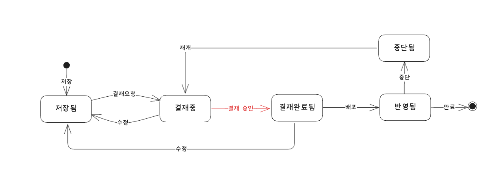
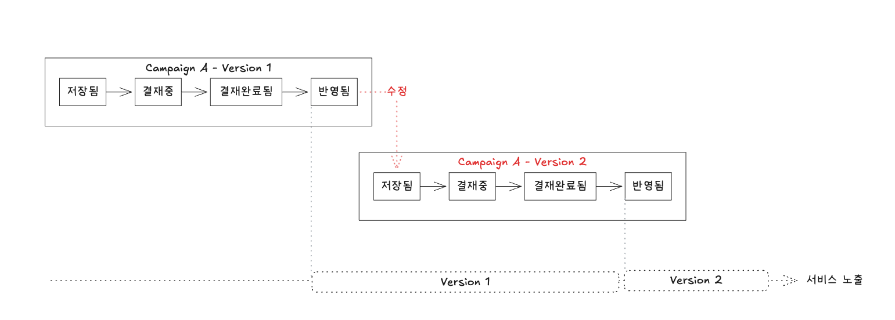

# 결재 기반 상태 관리와 무중단 컨텐츠 배포

## 1. 문제 (Problem)

### 제휴 컨텐츠의 중요성 및 운영 리스크

제휴사 컨텐츠(이미지, 혜택 문구)는 사용자의 혜택 경험과 직결되므로 오타나 잘못된 이미지가 노출되어서는 안 됩니다.  
따라서 단순한 등록/수정 권한만으로는 부족하며, **확실한 검증과 승인(Approval)을 거친 컨텐츠만 노출**되도록 강제할 필요가 있었습니다.

- **컨텐츠 정합성 리스크**: 운영자의 실수로 오타나 잘못된 이미지가 검증 없이 라이브 서비스에 노출될 위험.
- **수정 시점의 불안정**: 운영 중인 라이브 컨텐츠를 수정할 경우, 수정하는 순간에 데이터 불일치가 발생할 가능성.

## 2. 전략 (Strategy)

### A. 결재 기반 도메인 상태 관리

도메인(캠페인)의 라이프 사이클 내 결재 프로세스 연동을 통해 '결재된' 상태가 아니면 절대 서비스에 노출되지 않도록 설계했습니다.



- **Safety**: 서비스에 노출되는 컨텐츠들은 API 조회 조건에 `WHERE status = 'Published'` 상태만 포함됩니다.
- **Audit**: 모든 상태 변경은 이력으로 남으며, 결재시스템에서 결재권자의 승인이 있어야만 `결재완료됨` -> `반영됨` 상태로 전이가 가능합니다.

### B. 버전 관리로 무중단 컨텐츠 배포

이미 `반영됨(Published)` 상태로 서비스 중인 컨텐츠를 수정해야 할 때, **기존 Row를 덮어쓰지 않고 새로운 버전을 생성**하는 방식을 택했습니다.  
아래 그림과 같이 반영된 상태에서 수정 할 경우 새로운 버전이 채번되며, 서비스에서는 버전 기준으로 최신 상태인 컨텐츠를 조회하도록 설계되었습니다.

**무중단 컨텐츠 배포 설계**


**서비스 쿼리**

```sql
SELECT *
FROM campaign
WHERE campaign_id = :campaignId
  AND status = 'Published'
ORDER BY version DESC
LIMIT 1;
```

- **Isolation**: 수정 작업은 `v2(Saved)`에서 이루어지므로, 사용자는 여전히 `v1`을 안정적으로 보고 있습니다.
- **정합성**: 별도의 스위칭 작업 없이, 쿼리 시점에 가장 높은 버전을 선택하는 로직을 통해 자연스럽게 최신 데이터 정합성을 유지합니다.

## 3. 결과 (Result)

- **내부 통제 강화**: 결재 프로세스를 시스템에 내재화하여 변경 이력의 추적성을 확보하고 책임 소재를 명확히 함.
- **운영 리스크 차단**: 검증되지 않은 컨텐츠의 노출을 원천 차단하여 Human Error에 의한 사고 가능성을 구조적으로 제거.
- **무중단 운영**: 서비스 중단 없이 언제든지 안전하게 컨텐츠 수정 및 롤백 가능.

---

## 🔗 관련 문서

- [L1. 프로젝트 목록 > 선택하고 혜택받기](/docs/career/projects#6-선택하고-혜택받기-서비스-개발-202407--202410)
- [L1. 프로젝트 목록 > 돈 버는 서베이](/docs/career/projects#5-돈-버는-서베이-서비스-개발-202404--202510)
