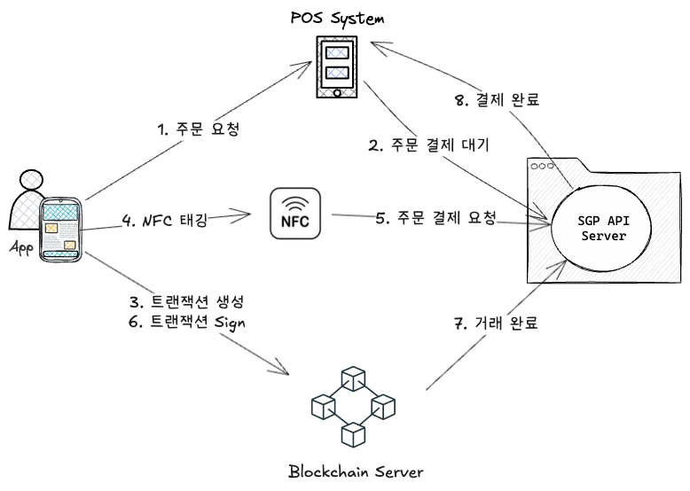

# 이기종 시스템 간 결제 상태 동기화: Long Polling과 상태 머신 전략

## 1. 문제 (Problem)

### 물리적 제약이 있는 분산 환경의 정합성

블록체인 기반 포인트 결제 시스템은 **블록체인 원장, POS 시스템, 모바일 앱, API 서버**가 유기적으로 연결되어야 했으나, 각 시스템의 기술적 제약으로 인해 단일 트랜잭션 처리가 불가능했습니다.

- **POS 시스템의 통신 제약**: POS는 외부로부터 요청을 받을 수 없는 구조였기에, 결제 완료 여부를 실시간으로 인지하기 어려웠습니다.
- **보안 제약 (Client-side Signing)**: 블록체인 전자서명을 위한 Private Key는 보안상 API 서버가 소유하지 않고 모바일 앱(사용자)에만 존재했습니다.
- **상태 추적의 난해함**: 사용자가 앱에서 서명을 완료하고 블록체인에 트랜잭션이 기록되는 시점을 API 서버가 직접 제어할 수 없어, POS와의 결제 상태 동기화가 끊기는 리스크가 존재했습니다.

## 2. 전략 (Strategy)

### Long Polling과 상태 기반 동기화 아키텍처

물리적 제약을 극복하고 결제의 신뢰성을 보장하기 위해, 상태 저장과 비동기 응답 기술을 조합했습니다.

1.  **Spring DeferredResult를 이용한 Long Polling**

    - Push를 받지 못하는 POS 시스템을 위해 Long Polling 구조를 채택했습니다.
    - POS가 결제 상태를 요청하면, API 서버는 `DeferredResult`를 사용하여 응답을 보류하고, 결제 처리가 완료되는 즉시 대기 중인 스레드에 결과를 반환하여 Push와 유사한 효과를 구현했습니다.

2.  **단계별 상태 관리**

    - 결제 흐름을 `INIT`, `PENDING`, `COMPLETED`, `FAILED` 등의 세분화된 상태로 정의하여 기록했습니다.
    - 여러 API 서버 인스턴스 간에 결제 상태를 공유하고 `DeferredResult`를 처리하기 위해, **Global Cache**를 활용하여 분산 환경에서의 상태 정합성을 보장했습니다.
    - 최초 결제 요청 시 생성된 `Transaction ID`를 기준으로 모든 시스템 간의 메시지를 매핑하여 데이터 파편화를 방지했습니다.

3.  **전자서명과 원장 기록의 비동기 합의**
    - 사용자가 앱에서 서명 후 블록체인 노드로 전송하면, API 서버는 블록체인 서버에서 주는 `트랜잭션 ID`를 통해 성공 여부를 확인했습니다.
    - 확인된 즉시 보류 중이던 POS의 `DeferredResult`에 성공 응답을 전달하여, 전체 결제 프로세스가 하나의 트랜잭션처럼 작동하도록 동기화했습니다.

## 3. 결과 (Result)

- **결제 신뢰성 확보**: 이기종 시스템 간의 복잡한 통신 흐름 속에서도 상태 머신을 통해 결제 누락이나 중복 처리를 완벽하게 차단했습니다.
- **UX 개선**: 최장 10초 이상 소요될 수 있는 블록체인 트랜잭션 확정 과정을 Long Polling으로 매끄럽게 연결하여, 점원(POS)과 사용자(App) 모두 실시간에 가까운 결제 경험을 제공받았습니다.
- **정산 정합성**: 정확한 상태 기록을 바탕으로 블록체인 원장과 서비스 로그 간의 오차 없는 정산 시스템을 구축했습니다.

---

## 🔗 관련 문서

- [L1. 프로젝트 목록 > 블록체인 기반 포인트 서비스](/docs/career/projects#2-블록체인-기반-포인트-서비스-201903--202008)
