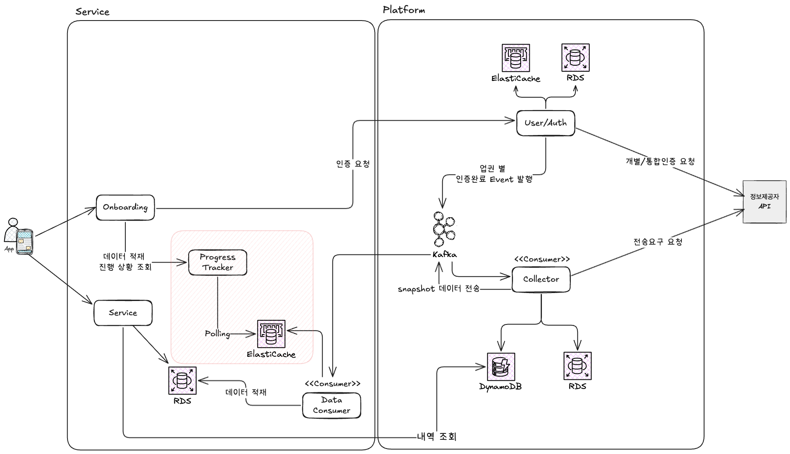

# 마이데이터 자산 조회: Progress Tracker를 통한 UX 개선

## 1. 문제 (Problem)

### 비동기 환경에서의 진척도 파악 어려움

마이데이터 서비스 초기에는 플랫폼 레벨에서 데이터 수집이 먼저 이루어졌고, 이후 서비스 요건이 추가되면서 실시간 자산 조회가 도입되었습니다. 하지만 이 과정에서 다음과 같은 기술적 난관이 발생했습니다.

1.  **긴 작업 시간**: 마이데이터 전송요구와 자산 수집은 여러 금융사와 연계되므로 전체 프로세스가 완료되기까지 수 초에서 수십 초가 소요됩니다.
2.  **레이어 간 격리**: 데이터 수집은 **플랫폼**에서 비동기로 처리되므로, 상위 **서비스** 레이어에서는 현재 수집이 얼마나 완료되었는지 즉각적으로 알 수 없는 구조였습니다.
3.  **사용성 저하**: 사용자는 자산 수집이 완료될 때까지 로딩 바만 보며 기다려야 했고, 이는 높은 이탈률로 이어졌습니다.

## 2. 전략 (Strategy)

### A. Progress Tracker 모듈 도입

서비스 레이어와 플랫폼 레이어 사이의 상태 불일치를 해결하고, 사용자에게 실시간 피드백을 주기 위해 별도의 **Progress Tracker** 모듈을 설계했습니다.

### B. Redis 기반 상태 공유 및 내부 폴링

플랫폼이 수집 중인 상태를 서비스가 효율적으로 가져오기 위해 중간 저장소로 Redis를 활용했습니다.

1.  **플랫폼**: 업권별(은행, 카드 등) 전송요구 scope에 따라 수집을 진행하며, 각 단계 별 수집 완료 시 이벤트를 발행합니다.
2.  **Data Consumer**: 수집 완료된 이벤트를 받아 유저 키 별로 Redis에 적재합니다.
3.  **Progress Tracker (SSE Server)**:
    - 클라이언트와 **SSE(Server-Sent Events) 연결**을 유지합니다.
    - 내부적으로 Redis에 쌓이는 진척도 데이터를 **주기적으로 polling**합니다.
    - 변경된 상태가 있을 경우, SSE를 통해 클라이언트에게 즉시 이벤트를 발송합니다.

## 3. 결과 (Result)

- **UX 개선**: 사용자가 현재 업권 별 데이터를 데이터 수집 상태를 실시간으로 확인하게 함으로써 체감 대기 시간을 줄였습니다.
- **시스템 결합도 해제**: 서비스 레이어가 플랫폼의 내부 비동기 로직에 깊게 관여하지 않고도 이벤트를 통해 상태를 안전하게 전달받는 구조를 확립했습니다.

---

## 🔗 관련 문서

- [L1. 프로젝트 목록 > 마이데이터 서비스](/docs/career/projects#7-마이데이터-서비스-202211--202311)
